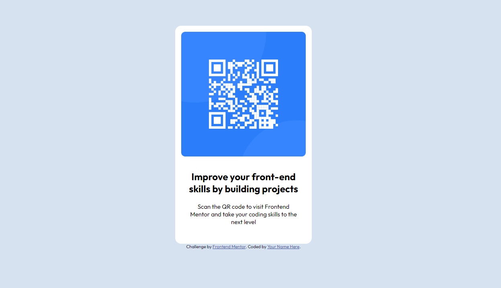

# QR code component
---
This is a QR Code component for linking to a website called Frontend Mentor

## Table of contents
---
- [QR code component](#qr-code-component)
  - [Table of contents](#table-of-contents)
  - [Overview](#overview)
    - [Screenshot](#screenshot)
    - [Links](#links)
  - [My process](#my-process)
    - [Built with](#built-with)
    - [Challenges](#challenges)
    - [Optimizations](#optimizations)
    - [Continued development](#continued-development)
    - [Useful resources](#useful-resources)
  - [Author](#author)
    - [Check out my other Projects](#check-out-my-other-projects)
  - [Acknowledgement](#acknowledgement)

## Overview
---
### Screenshot



### Links

- Live Site URL: [Visit Live Site](https://daniels-qr-code-component.onrender.com/)

## My process
---

### Built with

- Semantic HTML5 markup
- CSS custom properties
- Flexbox
- Mobile-first workflow


### Challenges

The image was behaving oddly and wasn't filling the container, I fixed it by displaying the image as a block and Hide the overflow

```css
.image-container {
    width:100%;
    border-radius:10px;
    overflow:hidden;
}
  .image-container > img{
          width:100%;
          display:block;
      }
```

### Optimizations

Better naming on css styles

### Continued development

In the future i would like to add a button that generates a QR Code based on what url you input.


### Useful resources

- [Css Tricks](https://css-tricks.com/) - This helped me for flexbox layoting reasons. I really liked this pattern and will use it going forward.


## Author
---
- Website -  [@DanielVidarHolm](https://danielholm.me/)
- Frontend Mentor - [@DanielVidarHolm](https://www.frontendmentor.io/profile/DanielVidarHolm)
- Twitter - [@DanielVidarHolm](https://twitter.com/DanielVidarHolm)
- Linked-in - [@DanielVidarHolm](https://www.linkedin.com/in/danielvidarholm/)
- Company Website - [@DH Web Design](https://dhwebdesigns.com/)

### Check out my other Projects

- [Card game](https://github.com/DanielVidarHolm/CardGame)
- [Heroes of might and magic Api](https://github.com/DanielVidarHolm/homm3-api)

## Acknowledgement
---
- No Acknowledgents for this project
